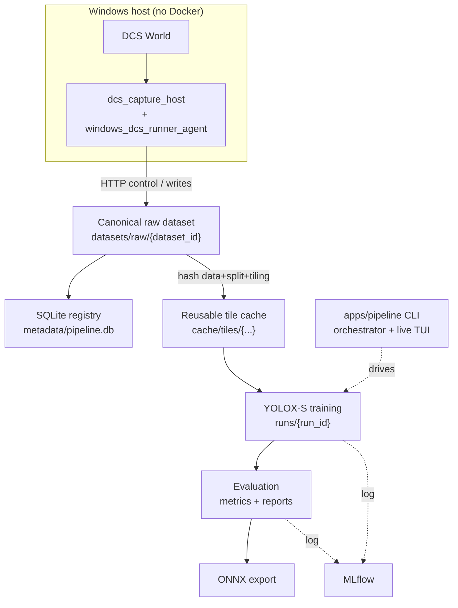

# DCS → YOLOX MLOps Pipeline

> End-to-end MLOps system that trains a maritime / airborne object detector
> (**ships · helicopters · airplanes**) on synthetic data captured from
> [DCS World](https://www.digitalcombatsimulator.com/), using
> [YOLOX-S](https://github.com/Megvii-BaseDetection/YOLOX).

<!-- When the repo is on GitHub, add a live CI badge, e.g.:
     [](../../actions/workflows/ci.yml) -->


It captures labelled frames from the simulator on a Windows host, registers each
dataset once in a content-addressed store, builds a reusable multi-scale tile
cache, trains YOLOX-S in Docker on the GPU, evaluates it, exports to ONNX, and
tracks everything in MLflow — all driven from a single Python CLI with a live
terminal dashboard. No Airflow, no web UI.

```
   DCS World ──capture (Windows host)──▶ raw dataset ──register──▶ SQLite registry
                                              │
                                              ├─ hash(data + split + tiling) ─▶ reusable tile cache
                                              ▼
                                       YOLOX-S training ──▶ evaluation ──▶ ONNX export
                                              │                  │             │
                                              └──────────── MLflow tracking ◀──┘
                                              ▲
                                   apps/pipeline CLI  (orchestrator + live TUI, --watch)
```

---

## Preview

**Dataset engine**


**Metrics MLFlow**


**Pipeline(CLI + TUI)**


---

## Contents

- [How it works](#how-it-works)
- [Repository layout](#repository-layout)
- [Prerequisites](#prerequisites)
- [Quick start (Docker)](#quick-start-docker)
- [Running the pipeline](#running-the-pipeline)
- [Host-side DCS capture (Windows)](#host-side-dcs-capture-windows)
- [Storage layout](#storage-layout)
- [Local development & tests](#local-development--tests)
- [Documentation](#documentation)
- [Third-party software (YOLOX)](#third-party-software-yolox)
- [License](#license)

---

## How it works

The system is one MLOps pipeline split across a **Windows capture host** (where
DCS World runs) and a **dockerized training/eval stack**. The guiding rule is
*a dataset is never copied between folders*: source images live in exactly one
canonical place, the tile dataset is a hash-addressed cache, and a run stores
only results plus references.



**Three identities keep data, cache and runs decoupled:**

| Identity        | Meaning                                                                                          |
| --------------- | ------------------------------------------------------------------------------------------------ |
| `dataset_id`    | a canonical raw dataset under `datasets/raw/`                                                     |
| `tile_cache_id` | `{dataset_hash}__{split_hash}__{tile_config_hash}` — a derived tile dataset, reused across runs   |
| `run_id`        | one pipeline execution; stores results + references, never a copy of the dataset                 |

**Classes (3):** `0` ships · `1` helicopters · `2` airplanes.

See [`docs/architecture.md`](docs/architecture.md) and
[`docs/data_flow.md`](docs/data_flow.md) for the component map and the exact
on-disk data flow.

---

## Repository layout

```
apps/
  dcs_capture/               # ingest boundary: adapter (DCS → COCO raw) + agent HTTP client
  dcs_capture_host/          # host-side DCS World capture (missions, projection, exporters, validators)
  windows_dcs_runner_agent/  # Windows host agent driven over HTTP
  dataset_enrichment/        # multi-scale tiling → content-addressed tile cache
  yolox_training/            # YOLOX-S Exp build + custom trainer
  evaluation_export/         # inference, metrics, full-image merge, ONNX export, reporting
  pipeline/                  # top-level orchestration CLI + live TUI
packages/common/             # shared libs (coco_io, tiling, letterbox, metadata_store, mlflow_utils, ...)
configs/                     # pipeline / classes / agent / retention configs
experiments/yolox/           # class_obj_at_sea Exp (3 classes, 640², multiscale off)
docker/                      # one Dockerfile per service (no Airflow)
scripts/                     # registration, validation, status, GC, migration helpers
tests/                       # pytest suite (unit + integration)
vendor/YOLOX/                # vendored upstream YOLOX, baked into the GPU images (see attribution below)
docs/                        # architecture, data_flow, docker, dcs_capture, tui
```

Storage is **not** part of this repo — see [Storage layout](#storage-layout).

---

## Prerequisites

| Scenario                          | CPU      | RAM   | GPU                          | Disk        |
| --------------------------------- | -------- | ----- | ---------------------------- | ----------- |
| Dev / CI (no training)            | 2+ cores | 4 GB  | —                            | a few GB    |
| Training (YOLOX-S @ 640²)         | 4+ cores | 16 GB | NVIDIA ≥ 6 GB VRAM (CUDA)    | 50+ GB SSD  |

- **Docker** with the **NVIDIA Container Toolkit** for the GPU services.
- DCS World capture runs **only on a Windows host** (see
  [Host-side DCS capture](#host-side-dcs-capture-windows)).
- TensorRT engines are **not portable** across GPUs / TRT versions — rebuild per
  target.

---

## Quick start (Docker)

The dockerized stack trains, evaluates, exports and tracks. (Capturing new data
from DCS is a separate, Windows-only step — see below. You can run the pipeline
against an existing dataset without DCS.)

```bash
# 1. Clone
git clone <your-repo-url> && cd MLOps_pipeline

# 2. Point STORAGE_ROOT at your data store (outside the repo)
cp .env.example .env
#    edit .env:  Windows → STORAGE_ROOT=D:\MLOps_storage
#                WSL/Linux → STORAGE_ROOT=/mnt/d/MLOps_storage

# 3. Build the images (YOLOX is baked into the two GPU images)
docker compose build

# 4. Start the MLflow tracking UI → http://localhost:5000
docker compose up -d mlflow

# 5. Verify the GPU is visible inside the training image
docker compose run --rm yolox-trainer python -m apps.yolox_training.cli check-env

# 6. Initialize the metadata registry (SQLite)
docker compose run --rm pipeline-controller \
  python -m scripts.init_metadata_db --config configs/pipeline.yaml
```

The five compose services:

| Service               | GPU | Lifecycle    | Purpose                                  |
| --------------------- | :-: | ------------ | ---------------------------------------- |
| `mlflow`              |  ✗  | `up -d`      | tracking server, port 5000               |
| `pipeline-controller` |  ✗  | `run --rm`   | orchestration CLI + TUI                  |
| `dataset-processor`   |  ✗  | `run --rm`   | adapter / enrichment / validation        |
| `yolox-trainer`       |  ✓  | `run --rm`   | training                                 |
| `evaluator-exporter`  |  ✓  | `run --rm`   | evaluation + ONNX export                 |

More detail in [`docs/docker.md`](docs/docker.md) and
[`docker/README.md`](docker/README.md).

---

## Running the pipeline

Everything is orchestrated by `apps.pipeline.cli`. Run the whole thing
end-to-end with a live terminal dashboard:

```bash
docker compose run --rm pipeline-controller \
  python -m apps.pipeline.cli run \
    --config configs/pipeline_production.yaml \
    --dataset-id dcs_caucasus_100 \
    --run-id prod_2026_06_04_001 \
    --watch
```

Useful subcommands (`python -m apps.pipeline.cli <cmd> --help`):

| Command           | What it does                                                            |
| ----------------- | ---------------------------------------------------------------------- |
| `run`             | run the pipeline; `--watch` renders a live TUI while it executes       |
| `run-all`         | run end-to-end, print a JSON result (no TUI)                           |
| `validate-config` | parse a config and print the resolved summary                         |
| `check-gpu`       | report GPU/CUDA status from inside the container                      |
| `new-run-id`      | generate the next `YYYY_MM_DD_NNN` run id                             |
| `status` / `tui`  | snapshot or attach a live dashboard to an existing run               |
| `gc`              | prune old runs / orphan tile caches / stale staging (dry-run default) |

Stage selection is supported via `--start-at`, `--stop-after`, `--only`,
`--skip`, and `--dry-run` (print resolved commands without executing).

**Configs** (`configs/`): `pipeline_production.yaml` (full GPU run),
`pipeline_smoke.yaml` (fast CPU data-flow smoke, no GPU/DCS),
`pipeline.yaml` / `pipeline_host.yaml` (host defaults), plus `classes.yaml`,
`dcs_agent.yaml`, and `retention.yaml`.

---

## Host-side DCS capture (Windows)

DCS World is a Windows-only simulator, so **all capture happens on the Windows
host, never inside Docker.** The dockerized pipeline only consumes the dataset
the host produces and talks to the capture agent over HTTP at
`host.docker.internal:8765`.

```powershell
# from D:\MLOps_pipeline (PowerShell)
py -m venv .dcs_venv
.\.dcs_venv\Scripts\Activate.ps1
pip install -r requirements-dcs-capture.txt   # numpy, pyyaml, opencv-python, pydcs

# install the DCS export hooks: copy apps/dcs_capture_host/dcs_export/*.lua into
# your DCS "Saved Games\...\Scripts" folder (see that directory's README)

# start the capture agent
python -m apps.windows_dcs_runner_agent.agent --config configs/dcs_agent.yaml
```

Capture writes straight to the canonical raw location
`STORAGE_ROOT/datasets/raw/{dataset_id}` — no intermediate copy. Full details,
including the scenario builder and projection model, are in
[`docs/dcs_capture.md`](docs/dcs_capture.md) and
[`apps/dcs_capture_host/README.md`](apps/dcs_capture_host/README.md).


(.dcs_venv) PS D:\MLOps_pipeline> D:\yolo\.dcs_venv\Scripts\python.exe orchestrator\main.py `
       --config configs\config.yaml `
       --mission D:\yolo\DCS_AutoDataset\missions\mvp_sea_scene.miz `
       --frames 50 `
       --frame-id real_run_001

---

## Storage layout

Storage lives **outside this repo** so the code stays clean and GitHub-ready.
Set `STORAGE_ROOT` in `.env`; it is bind-mounted to `/workspace/storage` in every
container.

```
${STORAGE_ROOT}/                 (host: D:\MLOps_storage  •  WSL: /mnt/d/MLOps_storage)
├── datasets/raw/{dataset_id}/   # the ONLY copy of source images + COCO annotations
├── cache/tiles/{hash}__{hash}__{hash}/   # reusable, content-addressed tile datasets
├── runs/{run_id}/               # per-run config, status.json, events.jsonl, logs, checkpoints, exports, reports
├── metadata/pipeline.db         # SQLite registry (datasets, runs, artifacts, tile_caches, ...)
├── mlflow_artifacts/            # MLflow artifact store
└── pretrained/                  # base weights
```

---

## Local development & tests

You can run the test suite and linters without Docker or a GPU — the heavy ML
tests (torch / YOLOX / ONNX / TensorRT / MLflow / GPU) self-skip when their
dependencies are absent.

```bash
pip install -e ".[dataset,agent,dev,tui]"
pytest -q          # unit + integration; heavy ML tests self-skip
ruff check .       # pyflakes (F) + import sorting (I)
```

[GitHub Actions](.github/workflows/ci.yml) runs ruff plus the CPU-only test
subset on every push / PR:

| Area                                                                                  | CI (ubuntu, CPU) | Docker / GPU host |
| ------------------------------------------------------------------------------------- | :--------------: | :---------------: |
| hashing, tile cache, run tracking, classes contract, SQLite registry, adapter, tiling |        ✅        |        ✅         |
| YOLOX training, ONNX / TensorRT export, GPU inference                                  |       skip       |        ✅         |
| DCS capture (`pydcs`)                                                                  |        —         | Windows host only |

---

## Documentation

| Doc | Topic |
| --- | ----- |
| [`docs/architecture.md`](docs/architecture.md)   | components & responsibilities |
| [`docs/data_flow.md`](docs/data_flow.md)         | dataset / cache / run data flow |
| [`docs/docker.md`](docs/docker.md)               | services, build, GPU |
| [`docs/dcs_capture.md`](docs/dcs_capture.md)     | host-side DCS World capture & agent |
| [`docs/tui.md`](docs/tui.md)                     | terminal monitoring |

Most components also carry their own `README.md` (e.g.
[`apps/dcs_capture_host/`](apps/dcs_capture_host/README.md),
[`configs/`](configs/README.md), [`docker/`](docker/README.md)).

---

## Third-party software (YOLOX)

This project trains [YOLOX](https://github.com/Megvii-BaseDetection/YOLOX) (v0.3.0)
by Megvii, which is licensed under the **Apache License 2.0**. A partial vendored
copy lives in [`vendor/YOLOX/`](vendor/YOLOX/) and is installed into the GPU
Docker images at build time. The YOLOX source is unmodified; only non-essential
files (assets, demos, docs, tests, CI config) were removed to reduce size — see
[`vendor/YOLOX/README.md`](vendor/YOLOX/README.md) for the exact change list and
[`THIRD_PARTY_NOTICES.md`](THIRD_PARTY_NOTICES.md) for full attribution.

---

## License

Copyright 2026 Mikhail Sankov. Licensed under the **Apache License 2.0** — see
[`LICENSE`](LICENSE) and [`NOTICE`](NOTICE).
